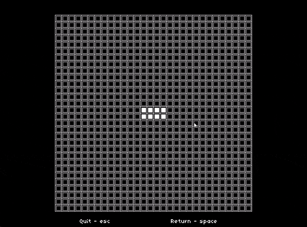

# Conway's Game of Life with Custom Rules

This project is an implementation of **Conway's Game of Life** using [Lua](https://www.lua.org/) and the [LÖVE 2D](https://love2d.org/) framework. It features **customized rules** that modify the behavior of the original game, allowing for creative and varied cell interactions.




## 🧠 Custom Game Rules

The traditional Game of Life rules have been modified as follows:

1. Any **live** cell with **no neighbors** dies due to underpopulation.
2. Any **live** cell with **more than 5 neighbors** dies due to overpopulation.
3. Any **live** cell at the **border of the grid** dies.
4. Any **dead** cell with **more than 3 neighbors** becomes alive.
5. All other cells remain in their current state.


## 🚀 Getting Started

### Requirements

- [LÖVE 2D](https://love2d.org/) (version 11.0+ recommended)

### Installation & Running

1. **Install LÖVE 2D:**
   - Download and install from [https://love2d.org/](https://love2d.org/)

2. **Clone the repository:**
   ```bash
   git clone https://github.com/nazmul-islam00/Game-of-Life.git
   cd Game-of-Life

3. **Run the game:**
   ```bash
   love .
   ```

## 📁 Project Structure

```bash
Game-of-Life/
├── main.lua          # Entry point
├── Grid.lua          # Game grid and cell logic
├── Box.lua           # Cell rendering and interaction
├── class.lua         # OOP helper for Lua
├── push.lua          # Resolution handling library
├── font.ttf          # Game font
├── game-of-life.gif  # Sample gameplay preview
└── README.md
```

## 🎮 Controls
- Left Click: Toggle a cell's state (alive/dead)
- Spacebar: Start or pause the simulation
- R: Reset the grid
- Escape: Exit the game

## 🧾 License
This repository is licensed under the [MIT License](LICENSE).

## 🙌 Acknowledgments

- [Conway's Game of Life](https://en.wikipedia.org/wiki/Conway%27s_Game_of_Life)
- [LÖVE 2D Framework](https://love2d.org/)

